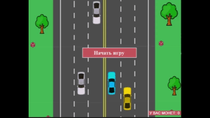

# 🏎️ AEGI_Game1

**Гоночная игра, разработанная командой студентов в рамках университетского курса**



## 📌 Описание

AEGI_Game1 — это 2D гоночная игра, в которой игрок управляет автомобилем, двигается по трассе, избегает препятствий и зарабатывает очки. Игра сохраняет очки до закрытия, позволяя стремиться к новым рекордам.  

Игра демонстрирует основы работы с графикой, обработку ввода с клавиатуры и базовую логику игрового процесса на C#.

## 👥 Команда разработчиков

- **Хаматвалиева Элина** — [@Khelyus](https://github.com/Khelyus)  
- **Гареева Гузалия** — [@guzaliya29](https://github.com/guzaliya29) 
- **Алина** — [@suchappy](https://github.com/suchappy)  
- **Ильмира** — [@ILMIIIRA](https://github.com/ILMIIIRA)  

## ⚙️ Технологии

- **Язык программирования**: C#  
- **Платформа**: .NET Framework  
- **Среда разработки**: Microsoft Visual Studio  

## 🚀 Установка и запуск

1. Клонируйте репозиторий:

   ```bash
   git clone https://github.com/Khelyus/AEGI_Game1.git
